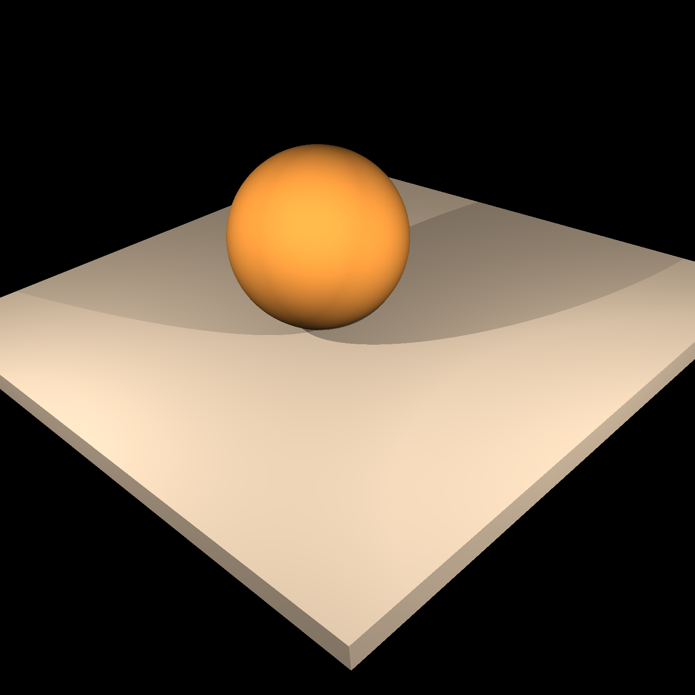
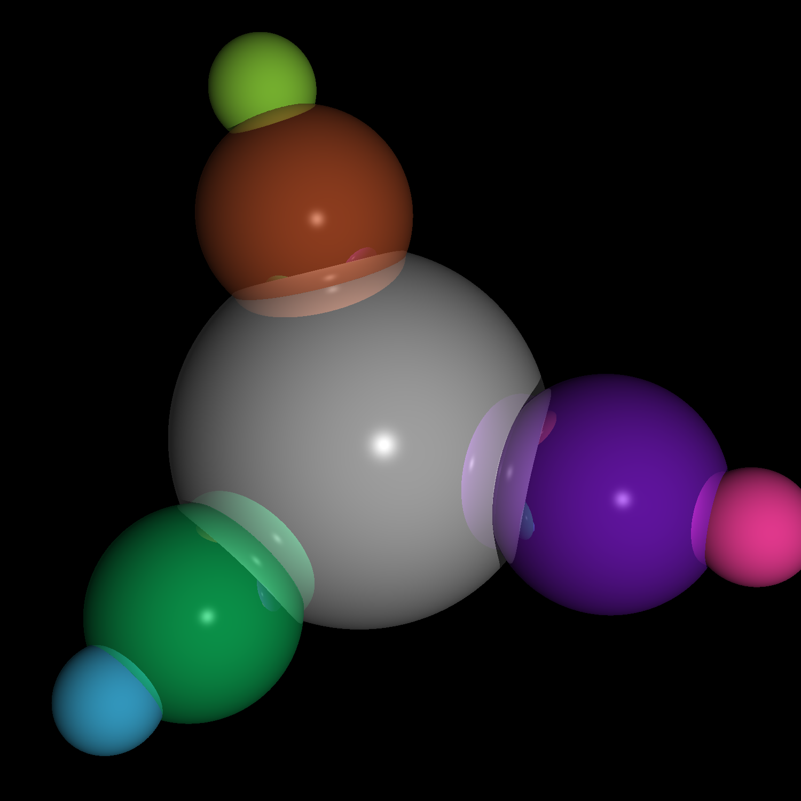
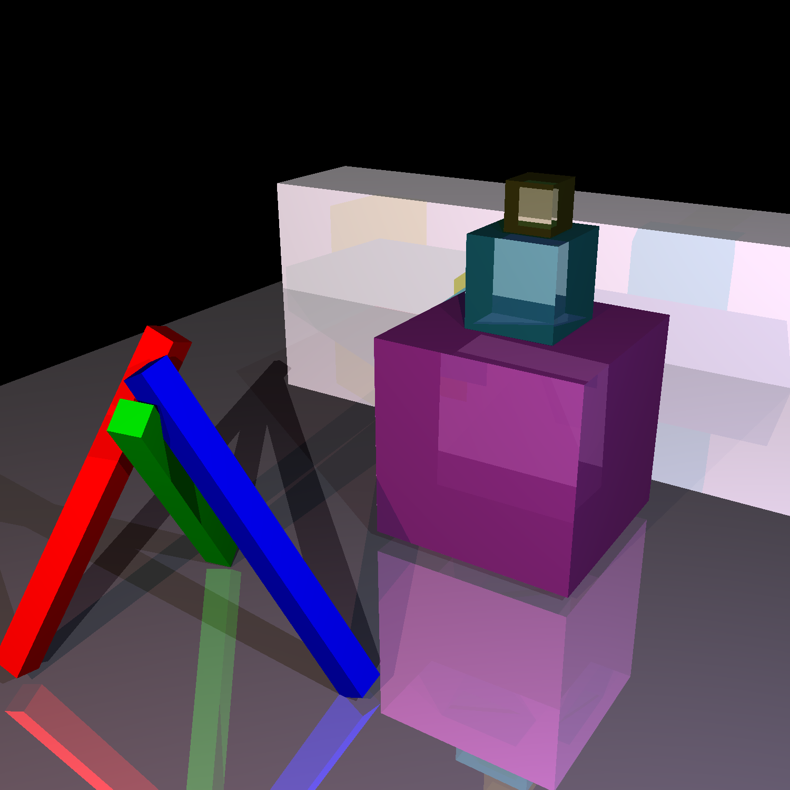
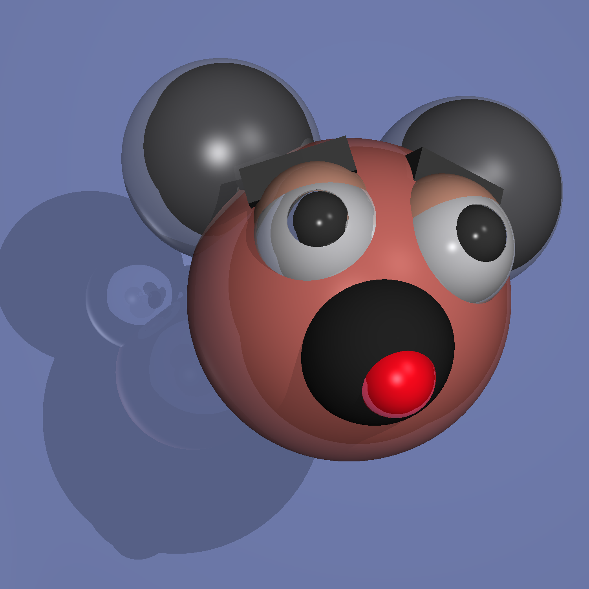
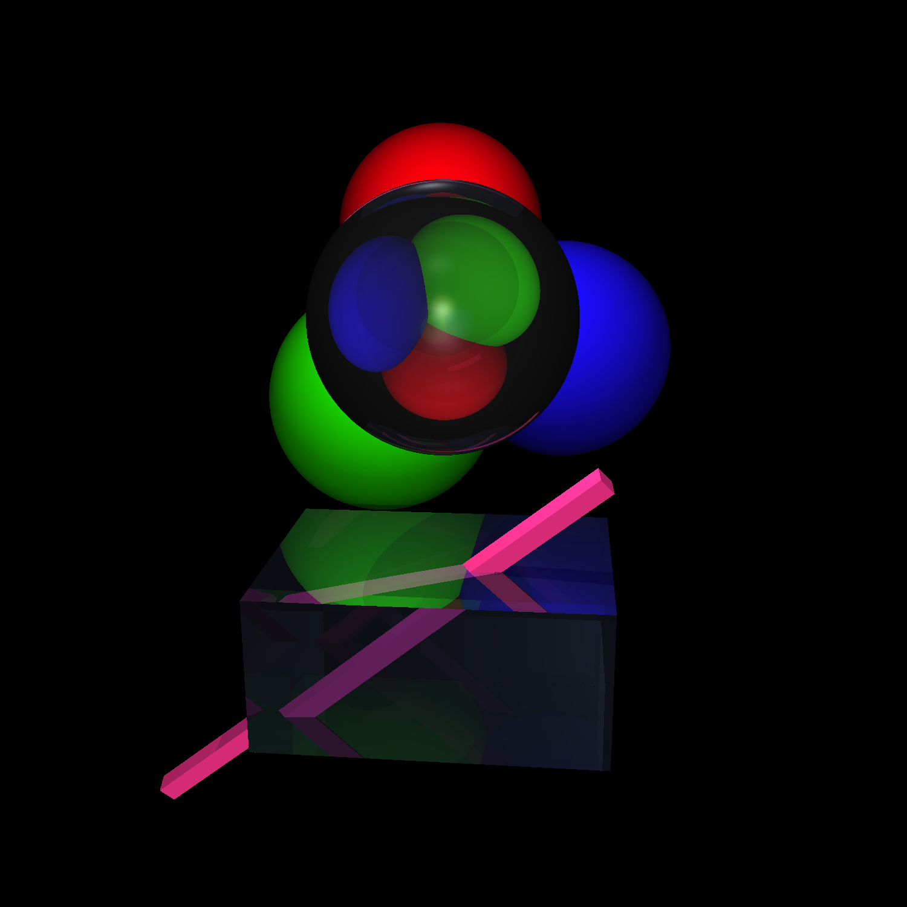

# CS285 Assignment2 : RayTracer
Goksu Guvendiren Bakir

In this assignment, I implemented a *Whitted Ray Tracer*. My results for the inputs are as follows:

For the 4th test case, in my opinion there may be a problem. I haven't figured that out until today, thinking that the mickey(?)'s face is inside a refractive medium (like half inside water), but after checking the input I realized that it's actually a reflection on the face. I think I have checked everything to find a bug, but I couldn't figure out why, and the values I checked actually made sense, so I'm leaving it as it is, thinking maybe that's actually the desired output. 

For the rest of the inputs, I think I was able to render correctly.

For the input files, I may have changed some values of lights, etc. Therefore for regenerating the inptus, running my code with the inputs inside my tarball should be fine.

The running times for the input cases on my desktop in release configuration are like this:

	* Test1 : 1312 ms
	* Test2 : 582 ms
	* Test3 : 12774 ms
	* Test4 : 5283 ms
	* Test5 : 3874 ms

I build my project using cmake, it only assumes OpenCV is installed.

Finally, overall I really enjoyed implementing this, hope you like it. 

Best,
Goksu.
